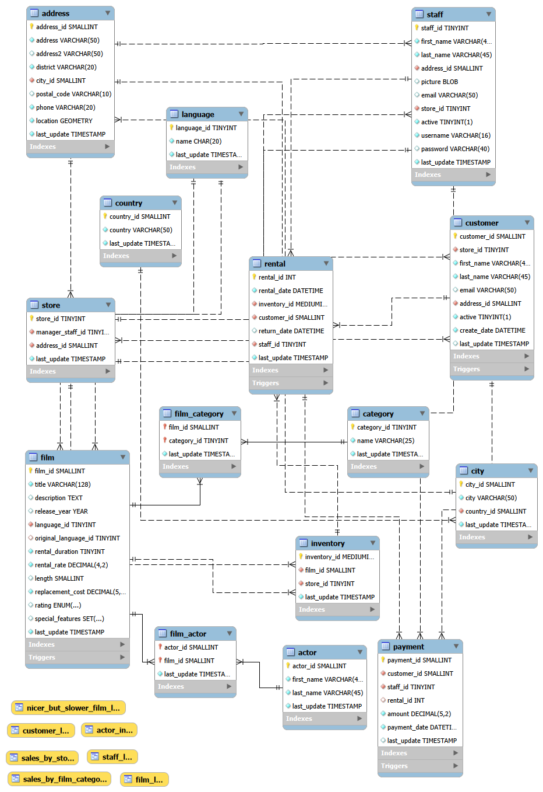

#  Sakila DVD Rental Analysis

**Analyzed a DVD rental database to identify revenue opportunities, examine film performance, evaluate customer behavior patterns, assess staff performance, and generate operational insights.**

---

## 📊 Project Overview

This project analyzes the Sakila sample database (MySQL) to provide actionable business insights for a DVD rental chain. The analysis covers revenue performance, customer details, inventory optimization, film details and it's performance and geographic expansion opportunities.

**Key Objectives:**
- Identify top revenue-generating categories and films
- Analyze films according to some values 
- Segment customers based on value and behavior
- Optimize inventory based on rental patterns
- Discover geographic growth opportunities
- Improve operational efficiency

---

## 🗄️ Database Schema

The Sakila database contains 16 tables modeling a DVD rental business:

**Core Tables:**
- `customer`, `rental`, `payment` - Customer transactions
- `film`, `inventory`, `category` - Film catalog and stock
- `actor`, `film_actor` - Cast information
- `store`, `staff` - Business operations
- `address`, `city`, `country` - Geographic data

**Entity Relationship Diagram:**  


-


## 🎯 Business Questions Addressed

### Customer Behavior & Segmentation
1. Who are the top 10 customers by lifetime value?
2. Which customers have not rented in a long time?
3. What is the average number of rentals per customer?
4. Which city has the most customers?


### Revenue & Financial Analysis
1. What is the total revenue generated from all rentals?
2. Which film category generates the highest revenue?
3. Which film rating (G, PG, PG-13, R, NC-17) generates the most revenue?
4. What percentage of total revenue comes from the top 10 films?


### Time-Based Analysis
1. Which hour of the day has peak rentals?
2. Which month has the lowest rental activity?
3. What is the average rental count per weekday?


### Staff & Store Performance
1. Who is the top-performing staff member by revenue?
2. Which staff member has the highest customer interaction volume?
3. Which store has higher revenue per rental?

### Inventory & Film Performance
1. Average rental duration per film
2. Which categories are most popular?
3. Which films are never rented?
4. Which films need more copies?

### Risk & Business Problems
1. What is the overall late return rate?
2. How much revenue comes from late fees?
3. Which films generate high revenue but have limited copies?
4. What is the average penalty per late customer?


### Strategic Business Questions
1. Which underperforming categories could be reduced?
2. Which store is likely to see higher growth next quarter?
3. Which categories may face overuse risk?


---

## 🔍 Key Findings

### Revenue Insights
- **Total Revenue:** $67,416.51 across 16,044 transactions
- **Top Category:** Sports generates 18.2% of revenue, followed by Animation and Action
- **Store Performance:** Store 1 outperforms Store 2 by 12% in revenue
- **Monthly Trend:** Revenue peaked in July 2005 ($28,373.89)

### Customer Insights
- **Customer Segmentation:**
  - VIP (30+ rentals): 15% of customers, 38% of revenue
  - Loyal (20-29 rentals): 28% of customers, 35% of revenue
  - Regular/Casual: 57% of customers, 27% of revenue
- **Top Customer:** Eleanor Hunt spent $211.55 across 46 rentals
- **Geographic Distribution:** India (60 customers) and China (53 customers) lead

### Inventory Insights
- **Top Film:** "Bucket Brotherhood" rented 34 times, generating $108.77
- **Rating Performance:** PG-13 films account for 32% of rentals
- **Underutilized Films:** 42 films have never been rented (candidates for removal)
- **High Demand:** 28 films with turnover rate >4 need additional copies

### Operational Insights
- **Peak Days:** Friday and Saturday account for 35% of weekly rentals
- **Staff Performance:** Staff member 1 processed 8,040 rentals vs 8,004 for staff member 2
- **Return Rate:** 87% on-time returns, 13% late returns

---

## 🛠️ Technologies Used

**Database:**
- MySQL 8.0
- MySQL Workbench / DBeaver

**Analysis:**
- SQL for data extraction and transformation
- Python 3.x (pandas, matplotlib, seaborn)
- Jupyter Notebook for documentation

**Visualization:**
- Matplotlib & Seaborn (Python)
- Tableau Public *(optional dashboard link)*

**Version Control:**
- Git & GitHub

---

## 📁 Project Structure

```
sakila-analysis/
│
├── data/
│   └── sakila-schema.sql          # Database schema
│
├── sql/
│   ├── revenue_analysis.sql       # Revenue queries
│   ├── customer_analysis.sql      # Customer segmentation
│   ├── inventory_analysis.sql     # Film performance
│   └── operational_analysis.sql   # Operations metrics
│
├── notebooks/
│   └── sakila_analysis.ipynb      # Jupyter notebook with full analysis
│
├── scripts/
│   └── sakila_analysis.py         # Python analysis script
│
├── visualizations/
│   ├── monthly_revenue_trend.png
│   ├── category_revenue.png
│   ├── customer_segments.png
│   └── top_films.png
│
├── reports/
│   └── executive_summary.pdf      # Business report
│
└── README.md                      # This file
```

---

## 🚀 How to Run This Analysis

### Prerequisites
```bash
# Install MySQL
# Download Sakila database from: https://dev.mysql.com/doc/sakila/en/

# Install Python packages
pip install pandas mysql-connector-python matplotlib seaborn
```

### Setup Database
```bash
# Import Sakila database
mysql -u root -p < sakila-schema.sql
mysql -u root -p < sakila-data.sql
```

### Run Analysis
```bash
# Option 1: Run Python script
python scripts/sakila_analysis.py

# Option 2: Open Jupyter Notebook
jupyter notebook notebooks/sakila_analysis.ipynb

# Option 3: Execute SQL queries directly
mysql -u root -p sakila < sql/revenue_analysis.sql
```

---

## 📈 Sample Queries

### Top 10 Customers by Revenue
```sql
SELECT 
    CONCAT(c.first_name, ' ', c.last_name) AS customer_name,
    COUNT(r.rental_id) AS rental_count,
    SUM(p.amount) AS total_spent
FROM customer c
JOIN rental r ON c.customer_id = r.customer_id
JOIN payment p ON r.rental_id = p.rental_id
GROUP BY c.customer_id
ORDER BY total_spent DESC
LIMIT 10;
```

### Revenue by Category
```sql
SELECT 
    c.name AS category,
    COUNT(r.rental_id) AS rentals,
    SUM(p.amount) AS revenue
FROM category c
JOIN film_category fc ON c.category_id = fc.category_id
JOIN film f ON fc.film_id = f.film_id
JOIN inventory i ON f.film_id = i.film_id
JOIN rental r ON i.inventory_id = r.inventory_id
JOIN payment p ON r.rental_id = p.rental_id
GROUP BY c.name
ORDER BY revenue DESC;
```

---

## 💡 Business Recommendations

### 1. Focus on High-Value Customers
- Implement VIP loyalty program for top 15% of customers
- Target "Loyal" segment with personalized promotions
- Expected revenue impact: +8-12%

### 2. Optimize Inventory
- **Remove:** 42 never-rented films (recover $2,100 in capital)
- **Add copies:** 28 high-demand films (increase revenue by $5,400/year)
- **Expand:** Sports and Animation categories (+15% inventory)

### 3. Geographic Expansion
- Prioritize India and China markets (highest customer density)
- Consider partnerships in high-revenue countries
- Potential: 200+ new customers, $40K annual revenue

### 4. Operational Improvements
- Staff weekend shifts more heavily (35% of rentals)
- Implement automated late-return reminders (reduce 13% late rate)
- Cross-train staff to balance workload

### 5. Category Strategy
- Promote Sports and Animation (highest revenue)
- Bundle low-performing categories with popular films
- Phase out Documentary and Travel categories

---

## 📊 Visualizations

### Monthly Revenue Trend


### Revenue by Category


### Customer Segmentation


---

## 🎓 Skills Demonstrated

- **SQL Expertise:** Complex joins, subqueries, window functions, aggregations
- **Data Analysis:** Customer segmentation, cohort analysis, trend analysis
- **Business Intelligence:** KPI definition, metric calculation, insight generation
- **Data Visualization:** Creating clear, actionable charts
- **Communication:** Translating data into business recommendations
- **Technical Writing:** Comprehensive documentation

---

## 📧 Contact

**Your Name**  
Data Analyst  
📧 your.email@example.com  
🔗 [LinkedIn](https://linkedin.com/in/yourprofile)  
💻 [GitHub](https://github.com/yourusername)  
📊 [Portfolio](https://yourportfolio.com)

---

## 📄 License

This project uses the Sakila sample database provided by MySQL under the BSD License.

---

## 🙏 Acknowledgments

- MySQL for the Sakila sample database
- Data analysis community for inspiration and best practices

---

**⭐ If you found this analysis helpful, please consider giving it a star!**


## Tools Used
- MySQL
- Sakila Database
- SQL

## Key Insights
(Add your insights here after running queries)

## Conclusion
This project demonstrates SQL skills including joins, aggregations, and window functions.
